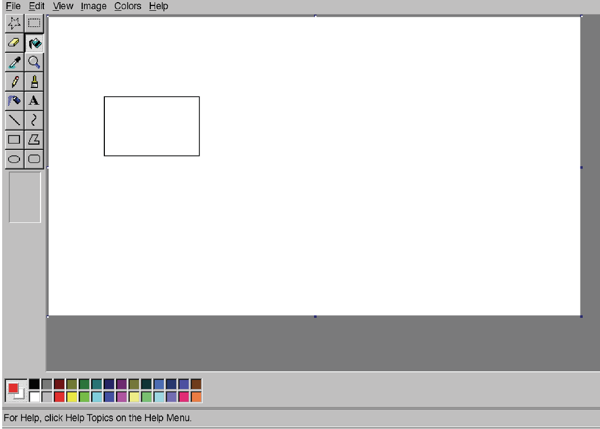
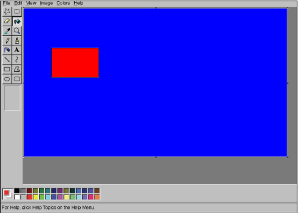

# Floodfill algorithm (BFS)
This repo includes a function `floodfill` to perform the floodfill algorithm on an image array. It supports B/W and RGB color data. Herein, the user chooses a pixel and a color. Subsequently, all adjacent pixels with the same color as that of the chosen pixel are updated with the provided color (like in MS Paint).
In `img_read.py`, an image file can be loaded and the result is then visualized (see [Example](##-Example)).

## Example

## Algorithm description
The algorithm uses Breadth-first search (BFS). It traverses the adjacent pixels, starting with the given initial pixel position. On each neighbor pixel, it is checked if the pixel has the same color and had not been visited before. In that case, the pixel is added to a queue. In each iteration, a pixel is popped from the queue. Its color is then changed to a user defined color and is marked as visited.
The algorithm terminates when the queue is empty.